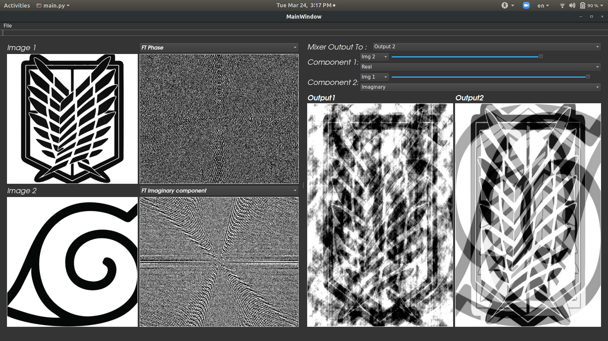

### Write your name and ID
## Name: Marwa Adel Youssef
## ID: 27

## GUI

### In The GUI I Can Control Which Side To Be Shown Bigger I Can Drag To Make The Left Side Of The Gui Take Large Space From The Window 

## ScreenShots 

# MagnitudePhaseMixerTemplate
Starter Template for Magnitude Phase Mixer Task

## install opencv to run the test file

## Implement the ImageModel in imageModel.py and its mix function
## run testTask.py --> python testTask.py
## assign a valid path for image1Path and image2Path
## Now when you run testTask you should get the following line
### AssertionError: This is not a numpy array, check the return value of your implemented mix function

## when you implement the mix function correctly you should get the following 2 lines
### Modes.magnitudeAndPhase passed successfully
### Modes.realAndImaginary passed successfully

## Do not forget to update the dep.txt file
